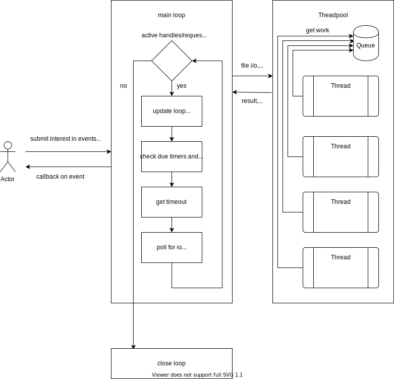

# Libapc

I made this project in order to understand the machanisms of [libuv](https://github.com/libuv/libuv), in doing so I copied some parts of the code of libuv.
If you want to use an event loop in production go to libuv.

Howerver if your interested in an simpler version of an event loop feel free to check this project out. I written 
and tested the code on linux (epoll is used as poll mechanism), so other operating systems are not suported.

1. [What can libapc do](#what-can-libapc-do)
2. [How does it work](#how-does-it-work)
3. [Usage](#usage)
    1. [Basic functions](#basic-functions)
    2. [Basic types](#basic-types)
    3. [Callback types](#callback-types)
    4. [TCP functions](#tpc-functions)
    5. [UDP functions](#udp-functions)
    6. [File functions](#file-functions)
    7. [Timer functions](#timer-functions)
    8. [Submitting work](#submitting-work)

## What can libapc do

There are 5 handle types:
    Base handle `apc_handle` (each handle below is also an `apc_handle`),
    TCP `apc_tcp`,
    UDP `apc_udp`,
    Timer `apc_timer` and
    File `apc_file`.

On these handles are then issued requests:
    `apc_connect_req` on the TCP handle,
    `apc_write_req` on the TCP and UDP handles,
    `apc_file_op_req` on the File handle.

Additionally a threadpool is provided where the user can submit some work with an `apc_wor_req`
request type.

A few example programs are provided in the example folder.

## How does it work



## Usage

A Makefile is provided. Create the static library `libapc.a` with `make lib`. Include the header file in your project an link to the library as well as to pthread while compiling.

### Basic functions
Initialize a loop with:
```C
    int apc_loop_init(apc_loop *loop)
```

Run the loop with:
```C
    void apc_loop_run(apc_loop *loop)
```

Close any handle with (typecast to `apc_handle *`):
```C
    int apc_close(apc_handle *handle)
```

Each function return either 0 on succes or an error code.
This function returns a short explanation for a given error code err:
```C
    const char *apc_strerror(enum apc_error_code_ err)
```

If you want to use a custom memory allocator you can pass the corresponding
functions to libapc so that they get used for internal memory allocations.
Default is `free(), malloc(), calloc(), realloc`. This function doesn't accept `NULL` values.
```C
   int apc_set_allocator(									
	void (*cust_free)(void *ptr), 
	void *(*cust_malloc)(size_t size),							
	void *(*cust_calloc)(size_t n, size_t size),				
	void *(*cust_realloc)(void *ptr, size_t size)				
  )
```

Init a basic buffer with:
```C
    apc_buf apc_buf_init(void *base, size_t len)
```
The base pointer isnt't freed by libapc, that is the users responsibility.

### Basic types

The loop type.
```C
    apc_loop
```

Base handle, each specific handle is a base handle.
The shown members are 'public'. The data pointer is meant for some user data and gets not
touched by libapc.
```C
    apc_handle{
        void *data;    
        apc_loop *loop;
        apc_handle_type type; 
    }
```

Each request has the same 'public' members:
```C
    req{
        void *data;
        apc_req_type type:
    }
```
The data pointer is meant for some user data and gets not touched by libapc.

A write request used for writing to a TCP or UDP handle.
```C
    apc_write_req 
```

A connect request used for connecting to a remote host. Only with TCP.
```C
    apc_connect_req
```

A work request used for submitting work to the threadpool.
```C
    apc_work_req 
```

A file operation reequest used for either writing or reading from a file.
```C
    apc_file_op_req 
```

The basic buffer used by libapc. The base pointer an len are set by the user.
```C
    apc_buf{
        char *base;
        size_t len;
    }
```

### Callback types
The `apc_alloc` callback type gets called each time before data is read from either a TCP or UDP handle.
The memory should be freed in the folowed `apc_on_read` callback.
```C
    void (*apc_alloc)(apc_handle *handle, apc_buf *buf)
```
Usually the implemented callback looks like this:
```C
    void my_alloc(apc_handle *handle, apc_buf *buf){
        buf->base = malloc(128 * sizeof(char));
        buf->len = 128 * sizeof(char);
    }
```

The `apc_on_read` callback type gets called each time there is data to beread from a TCP or UDP handle.
```C
    void (*apc_on_read)(apc_handle *handle, apc_buf *buf, ssize_t nread)
```

The `apc_on_connection` callback is used when implementing a TCP server. Each time a new client connects,
a function of this type gets called.
```C
   void (*apc_on_connection)(apc_tcp *tcp, int error) 
```

The `apc_on_connected` callback type gets called when the TCP handle connected to a remote host or an
error occured doing so.
```C
    void (*apc_on_connected)(apc_tcp *tcp, apc_connect_req *req, int error)  
```

The `apc_on_write` callback type gets called when a write to a TCP or UDP handle has finished, either 
successfull or with an error.
```C
    void (*apc_on_write)(apc_write_req *req, apc_buf *bufs, int error)
```

The `apc_work` callback type is used for submitted work.
```C
    void (*apc_work)(apc_work_req *work)
```

The `apc_on_file_op` callback type gets called on a finnished read or write operation on a file handle.
```C
    void (*apc_on_file_op)(apc_file *file, apc_file_op_req *req, apc_buf *bufs, ssize_t nbytes)
```
The `bufs` pointer either contains the data read or the data written. Allocated memory should be freed
here.


The `apc_on_timeout` callback type gets called on a due timer.
```C
    void (*apc_on_timeout)(apc_timer *handle) 
```

### TCP functions

The TCP handle type:
```C
    apc_tcp
```

Initialize a TCP handle with:
```C
    int apc_tcp_init(apc_loop *loop, apc_tcp *tcp)
```
No socket is created in this call.


Bind the TCP handle to `port` with:
```C
    int apc_tcp_bind(apc_tcp *tcp, const char *port)
```
In this function a socket is created.


Connect the TCP handle to a `host` on `service` with:
```C
    int apc_tcp_connect(apc_tcp *tcp, apc_connect_req *req, const char *host, const char *service, apc_on_connected cb) 
```
Service can be a port number or a protocoll like http. In this function a socket is created.


Write to the TCP handle wit:
```C
    int apc_tcp_write(apc_tcp *tcp, apc_write_req *req, const apc_buf bufs[], size_t nbufs, apc_on_write cb)
```
The content of `bufs` is copied so only the memory pointed to by each bufs base member needs to
stay valid till the callback.


Get a callback called each time there is data to be read from the TCP handle with:
```C
    int apc_tcp_start_read(apc_tcp *tcp, apc_alloc alloc, apc_on_read on_read)
```

Stop invoking a callback if there is data to be read from the TCP handle with:
```C
    int apc_tcp_stop_read(apc_tcp *tcp) 
```

Start listening for incomming connections on TCP handle with:
```C
    int apc_listen(apc_tcp *tcp, int backlog, apc_on_connection cb)
```

Accept a new connection on a TCP handle with:
```C
    int apc_accept(apc_tcp *server, apc_tcp *client) 
```
If this function is not called in the `apc_on_connection` callback, then the `server` handle stops listening for new connections.
The `client` handle needs to stay valid outside the callback function, thus should be allocated with `malloc` / `calloc` and should be intialized with `apc_tcp_init`.

### UDP functions

The UDP handle type:
```C
    apc_udp 
```

Initialize a UDP handle with:
```C
    int apc_udp_init(apc_loop *loop, apc_udp *udp) 
```
No socket is created in this call.

Bind the UDP handle to `port` with:
```C
    int apc_udp_bind(apc_udp *udp, const char *port) 
```
In this function a socket is created.

Connect the UDP handle to a `host` on `service` with:
```C
    int apc_udp_connect(apc_udp *udp, const char *host, const char *service)
```
Obviously this establishes not a connection like the TCP version of it. This function only fills in the internal `struct sockaddr_storage` to be used in subsequent `apc_udp_write` calls.
In this function a socket is created.

Write to either the remote host previously connected to or respond to an incomming massage with:
```C
    int apc_udp_write(apc_udp *udp, apc_write_req *req, const apc_buf bufs[], size_t nbufs, apc_on_write cb) 
```
The content of `bufs` is copied so only the memory pointed to by each bufs base member needs to
stay valid till the callback.

Get a callback called each time there is data to be read from the UDP handle with:
```C
    int apc_udp_start_read(apc_udp *udp, apc_alloc alloc, apc_on_read on_read)  
```

Stop invoking a callback if there is data to be read from the UDP handle with:
```C
    int apc_udp_stop_read(apc_udp *udp)
```

### File functions

The File handle type:
```C
    apc_file
```

Initialize a File handle with:
```C
    int apc_file_init(apc_loop *loop, apc_file *file)
```
No file descriptor is created in this call.

Open a file specified by `path` with access specified by `flags` with:
```C
    int apc_file_open(apc_file *file, const char *path, apc_file_flags flags)
```
There are currently 7 different `apc_file_flags`:
```C
    enum apc_file_flags {
        APC_OPEN_R = 1, 
        APC_OPEN_W = 2, 
        APC_OPEN_RW = 4, 
        APC_OPEN_CREATE = 8, 
        APC_OPEN_APPEND = 16, 
        APC_OPEN_TMP = 32, 
        APC_OPEN_TRUNC = 64
    }
```
These flags can be combined with `|`. If you pass the `APC_OPEN_CREATE` or `APC_OPEN_TMP` flag then you must also pass either the `APC_OPEN_W` or `APC_OPEN_RW` flag. If you pass the `APC_OPEN_CREATE` flag and the file specified by `path` already exists an error is returned. If you pass the `APC_OPEN_TMP` flag, then the `path` parameter should be a path to a directory. The temporary file can be made premanent with `apc_file_link_tmp`.

Fill the `struct apc_stat_ *stat` member of the File handle with:
```C
    int apc_file_stat(apc_file *file)
```
`struct apc_stat_` is defined as:
```C
    struct apc_stat_{
        dev_t st_dev;
        ino_t st_ino;
        mode_t st_mode;
        nlink_t st_nlink;
        uid_t st_uid;
        gid_t st_gid; 
        dev_t st_rdev;
        off_t st_size;
        long int st_blksize;
        blkcnt_t  st_blocks;
    } 
```

Read from a File handle to `bufs` with:
```C
    int apc_file_read(apc_file *file, apc_file_op_req *req, apc_buf bufs[], size_t nbufs, apc_on_file_op cb)
```
This function is basically the async variant of read/readv.

Write to a File handle from `bufs` with:
```C
    int apc_file_write(apc_file *file, apc_file_op_req *req, apc_buf bufs[], size_t nbufs, apc_on_file_op cb)
```
The content of `bufs` is copied so only the memory pointed to by each bufs base member needs to
stay valid till the callback.
This function is basically the async variant of write/writev.

Read from a File handle with an offset `offset` with:
```C
    int apc_file_pread(apc_file *file, apc_file_op_req *req, apc_buf bufs[], size_t nbufs, apc_on_file_op cb, off_t offset)
```
The offset ist measured from the start of the file, so any negative values will return an error. The file offset doesn't change by calling this function (no `lseek` is involved).
This function is basically the async variant of pread/preadv.

Write to a File handle with an offset `offset` with:
```C
    int apc_file_pwrite(apc_file *file, apc_file_op_req *req, apc_buf bufs[], size_t nbufs, apc_on_file_op cb, off_t offset)
```
The offset ist measured from the start of the file, so any negative values will return an error. The file offset doesn't change by calling this function (no `lseek` is involved).
This function is basically the async variant of pwrite/pwritev.

If a temporary file was opened it can be made permanent with:
```C
    int apc_file_link_tmp(apc_file *file, const char *path)
```
The `path` parameter should specify the new location and name for the file.

### Timer functions

The Timer handle type:
```C
    apc_timer
```

Initialize a Timer handle with:
```C
    int apc_timer_init(apc_loop *loop, apc_timer *timer)
```

Start a Timer handle with:
```C
    int apc_timer_start(apc_timer *timer, time_t duration, int restart, apc_on_timeout cb)
```
The unit of the `duration` parameter are seconds. If the timer should restart after the time out pass `1` as `reastart` value `0` otherwise.

Stop a Timer handle with:
```C
    int apc_timer_stop(apc_timer *timer)
```

Restart a Timer handl with:
```C
    int apc_timer_restart(apc_timer *timer)
```
To restart a Timer handle it needs to be already active.

### Submitting work

Submit some Work with:
```C
    int apc_add_work(apc_loop *loop, apc_work_req *req, apc_work work, apc_work done)
```